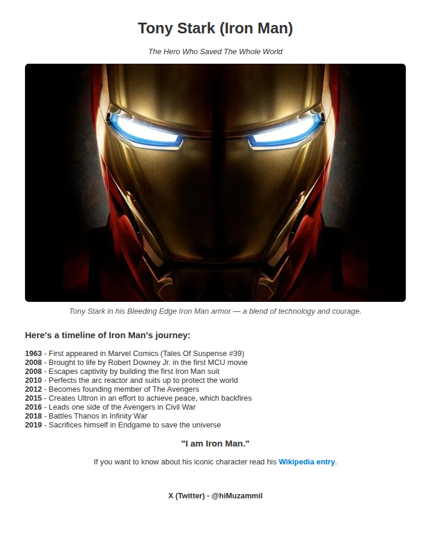

# Iron Man Tribute Page

This is a tribute page project created as part of the [freeCodeCamp Responsive Web Design Certification](https://www.freecodecamp.org/learn/2022/responsive-web-design/build-a-tribute-page-project/build-a-tribute-page). But I added a bit of spice to it, making it a tribute to Iron-Man.

## 🔥 About the Project

The page is dedicated to **Iron Man**, one of the most iconic superheroes from Marvel. It includes:

- A short biography
- Key achievements and timeline
- An image and external link for further reading

## 🛠️ Built With

- HTML5 (semantic elements)
- CSS3 (basic styling and layout)

## 📸 Preview

## 🚀 Live Demo

[View it on GitHub Pages](https://mozumil.github.io/Tribute-Page-Iron-Man/)

## 📁 Project Structure

fcc-tribute-page/
├── index.html
├── styles.css
└── README.md
 
## 📜 License

This project is open-source and free to use for educational purposes.
